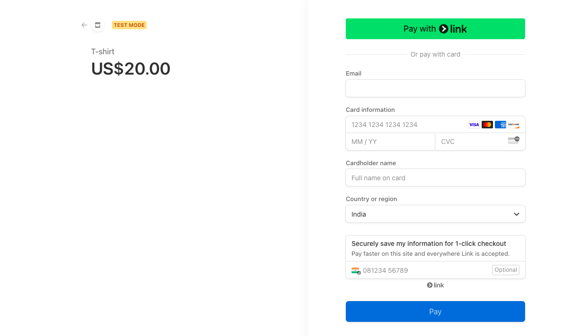

# Django Stripe Integration

This project demonstrates how to seamlessly integrate Stripe for secure online payment processing within your Django web application. Stripe is a leading payment gateway trusted by businesses worldwide. This README provides a detailed guide to set up and utilize the Django Stripe Integration effectively.

## Table of Contents

1. [Prerequisites](#prerequisites)
2. [Installation](#installation)
3. [Setup Stripe API Keys](#setup-stripe-api-keys)
4. [Configure Django](#configure-django)
5. [Stripe Webhook](#stripe-webhook)
6. [Running the Project](#running-the-project)
7. [Testing Payments](#testing-payments)
8. [Contributing](#contributing)
9. [License](#license)
10. [Features](#features)
11. [Troubleshooting](#troubleshooting)
12. [Future Enhancements](#future-enhancements)
13. [Acknowledgements](#acknowledgements)

---

## 1. Prerequisites

Before diving in, ensure you have the following installed:

-   **Python 3.x** (Download from [https://www.python.org/downloads/](https://www.python.org/downloads/))
-   **Django 4.x** (Install using `pip install django==4.x`)
-   **Stripe Account** (Create one at [https://stripe.com/](https://stripe.com/))
-   **Virtual Environment** (Create using `python -m venv <venv_name>` and activate it with `source <venv_name>/bin/activate` (Windows: `<venv_name>\Scripts\activate`))

## 2. Installation

1.  **Clone the Repository:**

    ```bash
    git clone [https://github.com/gitChandan123/stripe-integration-app.git](https://github.com/gitChandan123/stripe-integration-app.git)
    cd stripe-integration-app
    ```

2.  **Install Dependencies:**

    ```bash
    pip install -r requirements.txt # Assumes a requirements.txt file exists
    ```

## 3. Setup Stripe API Keys

1.  **Create a Stripe Account:** If you haven't already, visit [https://stripe.com/](https://stripe.com/) and sign up.
2.  **Retrieve API Keys:** In your Stripe dashboard, go to **Developers** -> **API keys**.
3.  **Securely Store Keys:** In your Django project's `settings.py`:

    ```python
    import os
    STRIPE_PUBLISHABLE_KEY = os.environ.get("STRIPE_PUBLISHABLE_KEY", "<YOUR_PUBLISHABLE_KEY>")
    STRIPE_SECRET_KEY = os.environ.get("STRIPE_SECRET_KEY", "<YOUR_SECRET_KEY>")
    ```

    **Important:** Use environment variables for production. **NEVER** commit API keys directly to your repository.

## 4. Configure Django

1.  **Add `stripe` App:** In `settings.py`:

    ```python
    INSTALLED_APPS = [
        # ... other apps
        'stripe',
        # ...
    ]
    ```

2.  **Webhook URL (Optional):** Define a URL for the webhook endpoint in `settings.py`:

    ```python
    import os
    STRIPE_WEBHOOK_SECRET = os.environ.get("STRIPE_WEBHOOK_SECRET", "<YOUR_WEBHOOK_SECRET>")
    ```

## 5. Stripe Webhook (Example)

```python
from django.conf import settings
from django.http import HttpResponse
from django.views.decorators.csrf import csrf_exempt
import stripe

stripe.api_key = settings.STRIPE_SECRET_KEY

@csrf_exempt
def stripe_webhook(request):
    payload = request.body
    sig_header = request.META['HTTP_STRIPE_SIGNATURE']
    event = None

    try:
        event = stripe.Webhook.construct_event(
            payload, sig_header, settings.STRIPE_WEBHOOK_SECRET
        )
    except ValueError as e:
        return HttpResponse(status=400)
    except stripe.error.SignatureVerificationError as e:
        return HttpResponse(status=400)

    if event['type'] == 'payment_intent.succeeded':
        payment_intent = event['data']['object']
        print("PaymentIntent successful:", payment_intent['id'])
        # Handle successful payment

    return HttpResponse(status=200)
